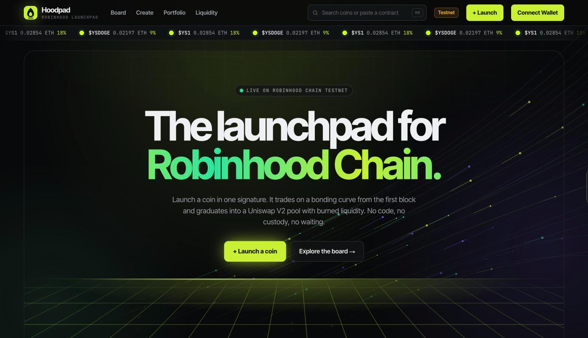
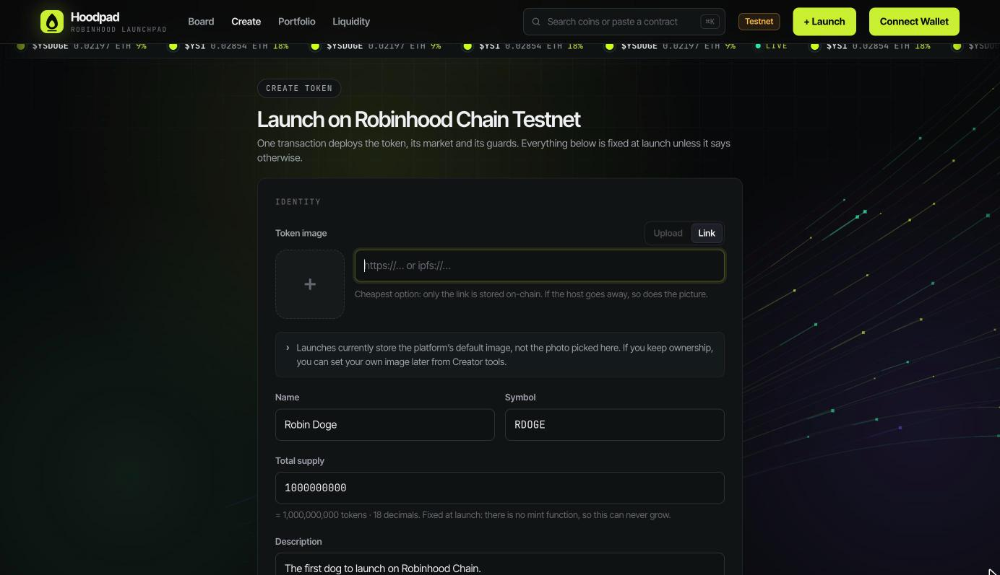
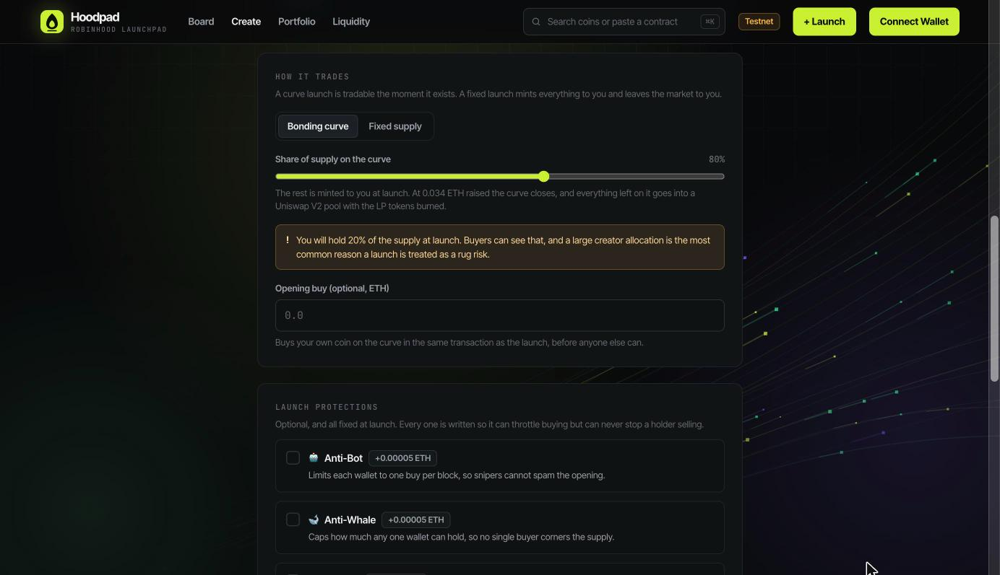
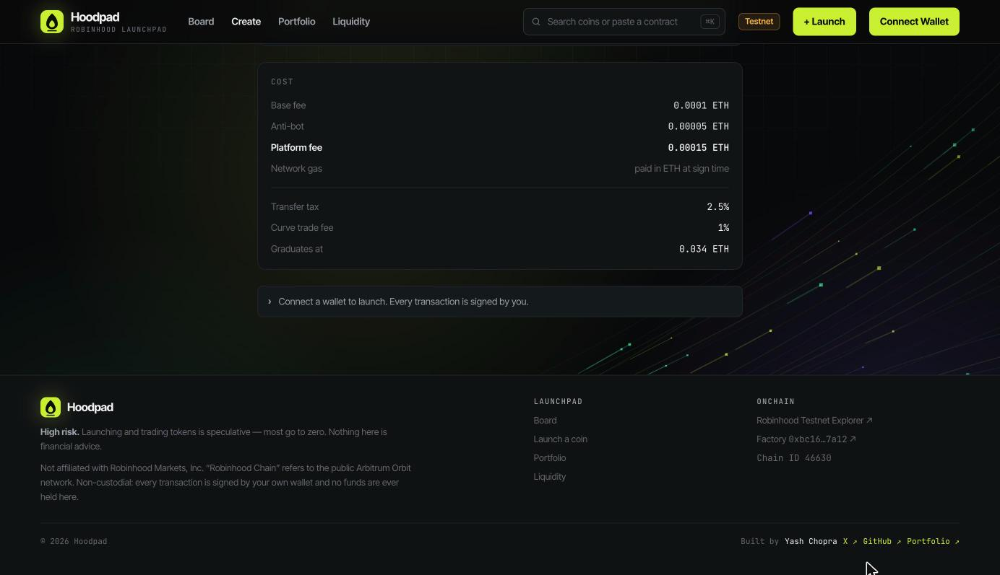
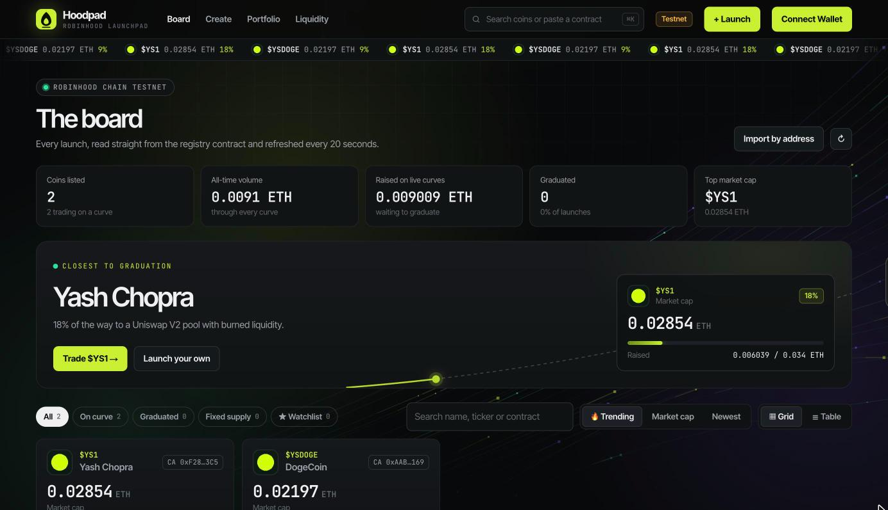
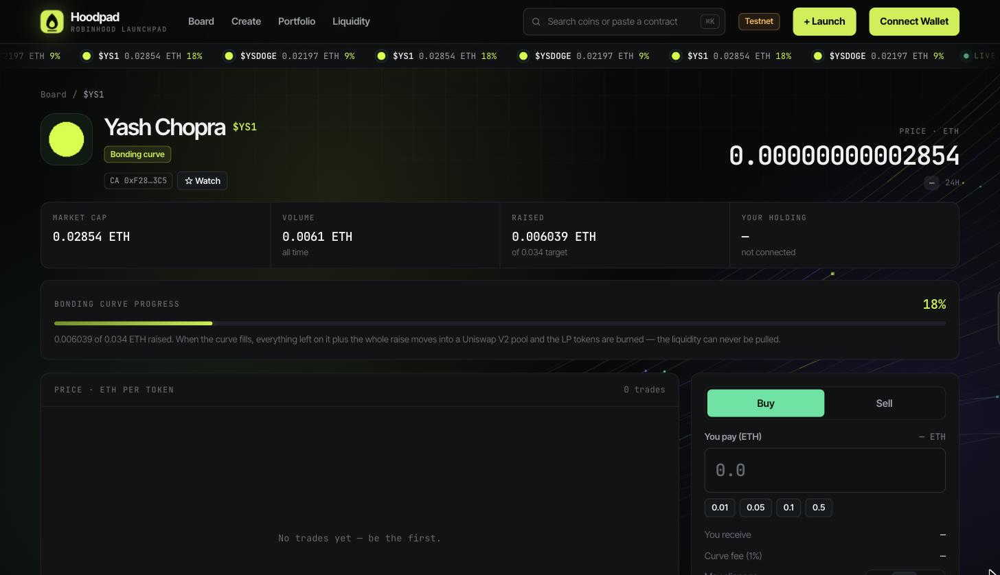

# Product demo: launch a coin

Hoodpad is a non-custodial, no-code launchpad for memecoins on **Robinhood Chain**,
a public Arbitrum Orbit network that uses ETH for gas. This page walks through a
launch from start to finish. Every screenshot is from the live app on Robinhood
Chain Testnet.


**Try it on testnet first.** On testnet every fee and the graduation target are
about 100× smaller than on mainnet. One claim from the
[Robinhood Chain faucet](https://faucet.testnet.chain.robinhood.com/) is enough
to launch a coin, trade it and push it all the way to graduation.


## The lifecycle at a glance

| Stage | What happens | Who acts |
| --- | --- | --- |
| **Create** | One signature deploys the token, its bonding-curve market and its guards. | The creator |
| **Trade** | Anyone can buy and sell from the first block. Each buy moves the price up the curve. | Everyone |
| **Graduate** | When the curve has raised its target, the raise and the remaining tokens seed a Uniswap V2 pool, and the LP tokens are burned. | The contract |

## 1. The landing page

<figure><figcaption>
The landing page, with live block heights streaming in from the chain.
</figcaption></figure>

The ticker along the top and the block stream in the hero are read straight from
Robinhood Chain over RPC. No server sits in between. From here:

* **+ Launch a coin** opens the create form.
* **Explore the board** lists every coin launched through the factory.

## 2. Connect a wallet

Click **Connect Wallet** in the top right and pick any EVM wallet. If your wallet
isn't on Robinhood Chain yet, Hoodpad asks it to add the network and switch to it.
If you're on another network, a **Switch to Robinhood Chain** button replaces the
launch button.

| Network | Chain ID | Gas token |
| --- | --- | --- |
| Robinhood Chain | `4663` | ETH |
| Robinhood Chain Testnet | `46630` | ETH |


Hoodpad never holds your keys or funds. Your wallet signs every transaction,
and there is no account to create.


## 3. Create your coin

Open **Create** from the navigation bar. The form has four parts, and a running
cost summary sits at the bottom.



### Identity

<figure><figcaption>
Name, symbol, supply and description.
</figcaption></figure>

* **Token image:** paste an `https://` or `ipfs://` link. Only the link is stored
  on-chain, so it is the cheapest option. Uploading a file is turned off for now.
  For now, launches store the platform's default image instead. If you keep
  ownership, you can set your own image afterwards from **Creator tools**.
* **Name** and **Symbol:** for example *Robin Doge* and *RDOGE*.
* **Total supply:** 1,000,000,000 by default. Supply is fixed at launch, and
  there is no mint function, so it can never grow.
* **Description**, **Website**, **Twitter / X** and **Telegram** are optional.
  They appear on the coin's page.



### How it trades

<figure><figcaption>
Bonding curve launch with 80% of the supply on the curve.
</figcaption></figure>

* **Bonding curve** (recommended): tradable the moment it exists. Use the slider
  to put 50–100% of the supply on the curve. The rest is minted to you, and
  the form warns you that buyers will see that allocation.
* **Opening buy** (optional): buy your own coin in the same transaction as the
  launch, before anyone else can.
* **Fixed supply:** every token is minted to your wallet and nothing trades until
  you open a pool yourself on the **Liquidity** page.



### Launch protections

All optional, all fixed at launch, and none of them can ever stop a holder from
selling.

| Protection | What it does |
| --- | --- |
| 🤖 **Anti-Bot** | Limits each wallet to one buy per block, so snipers can't spam the opening. |
| 🐋 **Anti-Whale** | Caps how much of the supply any one wallet can hold. Checked when tokens arrive, never when they leave. |
| 💸 **Add tax** | Your own transfer tax of up to 10%, on top of the platform tax. It is locked at launch and can never be raised. |
| 🔑 **Renounce ownership** | On by default. Drops the owner role after launch, so nothing about the coin can change afterwards, including its picture and links. |



### Review the cost and launch

<figure><figcaption>
The cost summary, read from the launchpad contract before you sign.
</figcaption></figure>

The summary lists the platform fee for the options you picked, your opening buy,
the total to send, and the rules the coin will trade under. Click **Launch coin**,
confirm in your wallet, and the coin is live as soon as the transaction lands.
If you left **Renounce ownership** on, your wallet asks for one more
transaction to renounce.



## 4. Find it on the board

<figure><figcaption>
The board: every launch, read from the registry contract.
</figcaption></figure>

The board refreshes every 20 seconds and shows:

* Headline stats: coins listed, all-time volume, ETH raised on live curves,
  graduations and the top market cap.
* **Closest to graduation:** the coin furthest along its curve.
* Filters (**All**, **On curve**, **Graduated**, **Fixed supply**, **Watchlist**),
  sorting (**Trending**, **Market cap**, **Newest**) and a grid or table view.

Paste a contract address into the search bar (<kbd>⌘</kbd> <kbd>K</kbd>) to jump
straight to a coin.

## 5. Trade on the curve

<figure><figcaption>
A coin page: stats, curve progress, price chart and the trade panel.
</figcaption></figure>

Each coin has its own page with:

* **Market cap**, **Volume**, **Raised** against the graduation target, and
  **Your holding**.
* **Bonding curve progress**: how close the coin is to graduating.
* A price chart and a feed of recent trades.
* The **trade panel**: choose **Buy** or **Sell**, enter an amount or use a
  preset (0.01, 0.05, 0.1, 0.5 ETH), check the quote, and pick a max slippage of
  1%, 2% or 5%.
* The coin's facts: creator allocation, taxes and whether ownership has been
  renounced. They are shown before you buy.

Click **☆ Watch** to add a coin to your watchlist on the **Portfolio** page.

## 6. Graduation

When a curve has raised its target, the contract:

1. stops trading on the curve,
2. adds every remaining curve token and the entire raise to a Uniswap V2 pool,
3. sends the LP tokens to a burn address.

Nobody holds the LP tokens, so nobody can pull the liquidity, not even the
creator. Holders keep everything they bought and carry on trading in the pool.


If a curve has reached its target but has not graduated yet, a creator who still
holds ownership can trigger it with **Graduate to a pool now** in **Creator
tools** on the coin page.


## 7. After launch: Portfolio and Creator tools

* **Portfolio** shows your ETH balance, the coins you created and your watchlist.
* **Creator tools** appear on the coin page while you still own the coin. Use
  them to edit the description and links, set the DEX router, register the pool
  for a taxed token, or renounce ownership.

## Fees

The app reads the exact figures from the launchpad contract and shows them on the
create page before you sign. These are the defaults the factory is deployed with:

| | Testnet | Mainnet |
| --- | --- | --- |
| Base launch fee | 0.0001 ETH | 0.01 ETH |
| Anti-Bot add-on | 0.00005 ETH | 0.005 ETH |
| Anti-Whale add-on | 0.00005 ETH | 0.005 ETH |
| Custom tax add-on | 0.0001 ETH | 0.01 ETH |
| Curve trade fee | 1% | 1% |
| Platform transfer tax | 2.5% | 2.5% |
| Graduation target | 0.034 ETH | 3.4 ETH |


**High risk.** Launching and trading tokens is speculative, and most go to zero.
Nothing here is financial advice. Hoodpad is not affiliated with Robinhood
Markets, Inc.

